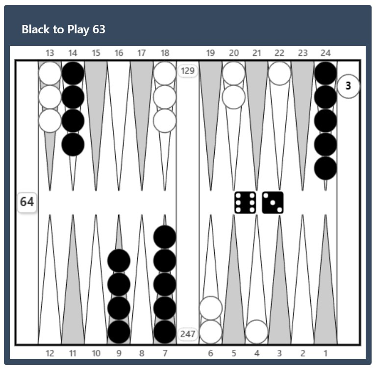
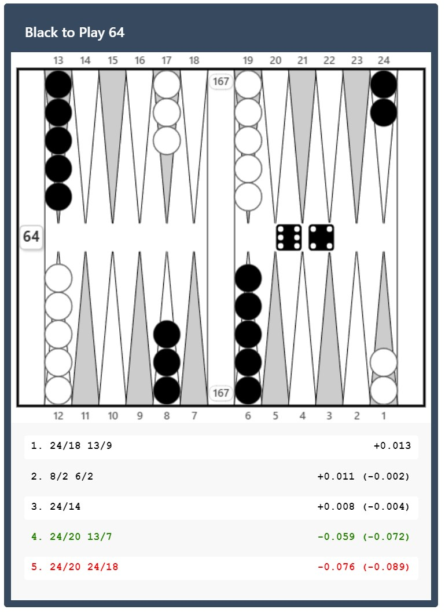
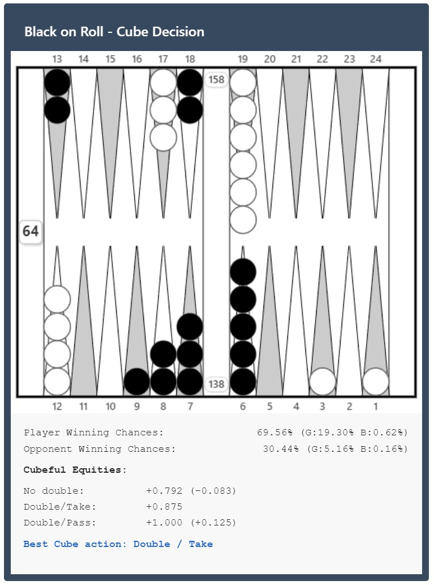

# Backgammon XGID Display

Renders backgammon positions and optional analysis in Obsidian given an XGID string. 

## What is this plugin?

- This plugin lets you display backgammon positions directly in your Obsidian notes using the XGID format. 
- Simply paste an XGID string in a code block, and get a fully rendered backgammon board.
- If analysis is included from XG, it will display it as well!
- Works on both desktop and mobile 

## Quick Start

### Installation

1. Open Obsidian Settings
2. Go to Community plugins
3. Search for "Backgammon XGID Display"
4. Install and enable the plugin


## Usage Examples

### 1. Simple Position copied from eXtreme Gammon (CTRL+SHIFT+C)

````
```xgid
XGID=-a-bE-D---cD---c-b-a-E-:0:0:1:63:0:0:0:0
```
````

Displays the opening position with X to play 6-3.



### 2. Position with Analysis copied from eXtreme Gammon (CTRL+C)

````
```xgid
XGID=-b----E-C---eE---c-e----B-:0:0:1:64:0:0:3:0:10
X:Player 1   O:Player 2

Score is X:0 O:0. Unlimited Game, Jacoby Beaver
 +13-14-15-16-17-18------19-20-21-22-23-24-+
 | X           O    |   | O              X |
 | X           O    |   | O              X |
 | X           O    |   | O                |
 | X                |   | O                |
 | X                |   | O                |
 |                  |BAR|                  |
 | O                |   | X                |
 | O                |   | X                |
 | O           X    |   | X                |
 | O           X    |   | X              O |
 | O           X    |   | X              O |
 +12-11-10--9--8--7-------6--5--4--3--2--1-+
Pip count  X: 167  O: 167 X-O: 0-0
Cube: 1
X to play 64

    1. Book¹       24/18 13/9                   eq:+0.013
      Player:   50.38% (G:13.61% B:0.64%)
      Opponent: 49.62% (G:13.55% B:0.58%)
      Confidence: ±0.002 (+0.010..+0.015) - [87.0%]

    2. Book¹       8/2 6/2                      eq:+0.011 (-0.002)
      Player:   49.76% (G:15.86% B:0.87%)
      Opponent: 50.24% (G:14.29% B:0.65%)
      Confidence: ±0.002 (+0.009..+0.013) - [12.9%]

    3. Book¹       24/14                        eq:+0.008 (-0.004)
      Player:   50.60% (G:11.94% B:0.57%)
      Opponent: 49.40% (G:13.10% B:0.47%)
      Confidence: ±0.002 (+0.006..+0.010) - [0.1%]

    4. Book²       24/20 13/7                   eq:-0.059 (-0.072)
      Player:   48.49% (G:13.89% B:0.65%)
      Opponent: 51.51% (G:14.29% B:0.65%)
      Confidence: ±0.007 (-0.066..-0.052) - [0.0%]

    5. Book³       24/20 24/18                  eq:-0.076 (-0.089)
      Player:   48.71% (G:11.29% B:0.48%)
      Opponent: 51.29% (G:14.59% B:0.51%)


¹Generated by Neil Kazaross on 12/17/2010 using eXtreme Gammon 2.00
  46656 Games rolled with Variance Reduction.
  Dice Seed: 41387960
  Moves and cube decisions: XG Roller+

²Generated by GameSite 2000, Ltd on 2/26/2011 using eXtreme Gammon 2.00
  10368 Games rolled with Variance Reduction.
  Dice Seed: 38613390
  Moves: 2-ply, cube decisions: 3-ply Red

³Generated by GameSite 2000, Ltd on 5/21/2011 using eXtreme Gammon 2.00
  Analyzed in XG Roller++


eXtreme Gammon Version: 2.10
```
````



### 3. Cube Analysis

````
```xgid
XGID=-a-a--ECBA--dB---cBf------:0:0:1:00:0:0:3:0:X:Player 1   O:Player 2
10

Score is X:0 O:0. Unlimited Game, Jacoby Beaver
 +13-14-15-16-17-18------19-20-21-22-23-24-+
 | X           O  X |   | O                |
 | X           O  X |   | O                |
 |             O    |   | O                |
 |                  |   | O                |
 |                  |   | 6                |
 |                  |BAR|                  |
 |                  |   | X                |
 | O                |   | X                |
 | O              X |   | X                |
 | O           X  X |   | X                |
 | O        X  X  X |   | X        O     O |
 +12-11-10--9--8--7-------6--5--4--3--2--1-+
Pip count  X: 138  O: 158 X-O: 0-0
Cube: 1
X on roll, cube action

Analyzed in XG Roller+
Player Winning Chances:   69.56% (G:19.30% B:0.62%)
Opponent Winning Chances: 30.44% (G:5.16% B:0.16%)

Cubeless Equities: No Double=+0.537, Double=+1.091

Cubeful Equities:
       No double:     +0.792 (-0.083)
       Double/Take:   +0.875
       Double/Pass:   +1.000 (+0.125)

Best Cube action: Double / Take

eXtreme Gammon Version: 2.10

```
````




## Troubleshooting

### Board not showing?

- Make sure you're using `xgid` as the code block language
- Check that your XGID string is properly formatted
- Ensure the position string is exactly 26 characters

### Analysis not displaying?

- Analysis must be in the same code block as the XGID
- Leave an empty line between the XGID and analysis
- Check that the analysis format matches eXtreme Gammon output

### Position looks wrong?

- Verify your XGID string is correct
- Check the turn field (-1 for O player, other for X)
- Ensure cube ownership is right (0=center, 1=X, 2=O)

## Getting XGIDs

You can get XGID strings from eXtreme Gammon:

- **Simple XGID** - "File -> Copy XGID to Clipboard" from the menu or with the hotkey CTRL+SHIFT+C
- **XGID with Analysis** - "File -> Copy position to Clipboard" from the menu or with the hotkey CTRL+SHIFT+C

## Development Setup

For local development:

1. Clone this repository
2. Run `npm install` to install dependencies
3. Run `npm run build` to build the plugin
4. (Optional) Set `OBSIDIAN_PLUGINS_PATH` environment variable to automatically copy built files to your Obsidian vault:
   ```bash
   export OBSIDIAN_PLUGINS_PATH="/path/to/your/vault/.obsidian/plugins/obsidian-backgammon-xgid"
   npm run build
   ```


## License


---

*Happy analyzing! 🎲*